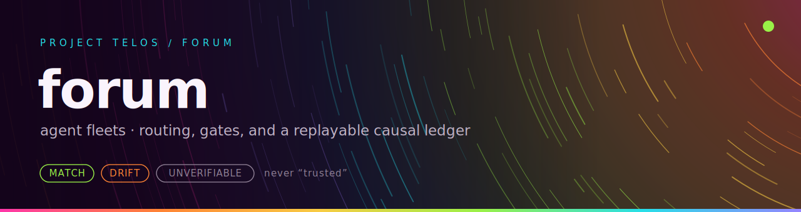

<p align="center"></p>

**Agent fleets with routing, quality gates, prose contracts, and a replayable causal ledger.**

[](https://pypi.org/project/forum-engine/)
[](LICENSE)
[](https://github.com/HarperZ9/forum/actions/workflows/ci.yml)
[](https://pypi.org/project/forum-engine/)


forum is a zero-dependency orchestration engine for fleets of agents: it routes a plain request to the right lane, plans a dependency graph into parallel waves, and runs it across model-agnostic executors (any command, any OpenAI-compatible server, the Anthropic API). Runs carry bounded budgets, witnessed model-tier escalation, expert delivery profiles that keep answers on contract, and checkpoints that let a crashed run resume where it stopped. An always-on daemon exposes the same engine over HTTP and MCP, driven by a single `forum` command. Every run writes a replayable causal ledger you can re-check.

[Project Telos](https://harperz9.github.io) | [gather](https://github.com/HarperZ9/gather) | [crucible](https://github.com/HarperZ9/crucible) | [index](https://github.com/HarperZ9/index) | [forum](https://github.com/HarperZ9/forum) | [telos](https://github.com/HarperZ9/telos) | [learn](https://github.com/HarperZ9/learn) | [emet](https://github.com/HarperZ9/emet) | [buildlang](https://github.com/HarperZ9/buildlang)

## Features

- **One command, three model backends.** `forum submit "ship a login API" --cmd "ollama run llama3"` plans the request, runs it across agents, and returns one synthesized answer. Swap `--cmd` for `--chat-url` (any OpenAI-compatible server) or `--api` (Anthropic). A local CLI needs no account.
- **Tiered executors.** Route task agents to cheap, capable, and frontier models by roster tier: `--cheap-cmd`, `--capable-cmd`, `--frontier-cmd`, or per-tier chat endpoints. Put the whole policy in a TOML file and load it with `--runtime-config`; `forum runtime inspect` explains the merged policy before anything runs.
- **Crash-safe runs.** Runs checkpoint at wave boundaries and resume from the durable ledger, reusing every task already witnessed as successful and re-running only the rest.
- **Human-in-the-loop approval gates.** Pause a run at a wave boundary until an operator approves, edits, or rejects it: `forum gate list / approve / edit / reject`. Gates can carry durable deadlines with a witnessed auto-decision on expiry, so an unattended run never stalls silently. See [docs/GATE-DEADLINES.md](docs/GATE-DEADLINES.md).
- **Campaigns.** Declare a multi-project campaign as a JSON feature graph, then drive it to a fixed point: `forum campaign declare / status / next / run / ingest-status`. Cycles are caught up front; external project status can be ingested without execution.
- **Bounded everything.** `RunBudget` caps a run by model calls and wall clock. `ContextBudget` admits, trims, or omits request context, per-task context, upstream injection, and synthesis inputs under approximate-token caps. `forum context preflight` estimates the pressure before you spend a model call.
- **Delivery quality gates.** A deterministic concision floor flags verbose answers; an opt-in reviser tightens them, accepted only if the shorter version still covers the request. Expert delivery profiles (`operator`, `engineer`, `researcher`, `executive`) check the final answer against a local prose contract, selected from the route by default.
- **Deterministic routing with a human contract.** `forum route` picks a lane from a 28-lane default roster without a model, and attaches a `forum.route-frame/v1` frame: domain, intent, posture, delivery profile, runtime tier, and an embedded communication contract that synthesis follows.
- **Witnessed escalation.** Every result records the model that produced it; a failed task escalates up a ladder of stronger executors on an auditable verdict.
- **Always-on surfaces.** One daemon (stdlib asyncio, no framework) serves the engine over HTTP; `forum mcp` exposes the same tools over MCP (stdio), a thin adapter over the HTTP surface so the two cannot drift.
- **Run rooms and capsules.** `forum ledger room --brief` projects the latest run into an operator brief with state, risk, and deterministic next actions. `forum ledger capsule` compacts a run into a reusable context brief for the next one.
- **Zero dependencies.** Pure standard library at runtime. Python 3.11+.

## Work with it

```bash
pip install forum-engine
```

Routing and the ledger commands need no model:

```bash
forum route "build the auth endpoint and the database schema"
```

```json
{
  "decided": "backend",
  "confidence": 0.6,
  "needs_escalation": false,
  ...
}
```

Answer a request with a local model (no account needed), then read the record:

```bash
forum submit "ship a login API" --cmd "ollama run llama3"
forum ledger show --limit 20
forum ledger verify
forum ledger room --brief
```

Run the daemon or the MCP server over the same engine:

```bash
forum serve --chat-url http://localhost:11434/v1/chat/completions --model llama3
forum mcp --cmd "ollama run llama3"
```

`forum --help` lists the full surface: `status`, `doctor`, `demo`, `humanize`, `route`, `submit`, `serve`, `mcp`, `context`, `runtime`, `ledger`, `gate`, `campaign`, `bench`, and `bench-deep-verify`. From a source checkout the same CLI is available as `python -m forum`. See [RUNNING.md](RUNNING.md) for real-model setups and [USAGE.md](USAGE.md) for the operator surface.

## A worked example: catch a tampered record

No install needed beyond a clone, and no model is called:

```bash
git clone https://github.com/HarperZ9/forum
cd forum
python examples/demo.py
```

The demo routes a few requests, plans a dependency graph into parallel waves, runs it, and then quietly corrupts one stored result:

```
4. Accountability: verify, tamper-detect, replay
  verify() (chain)      : True
  verify(deep=True)     : True
  causal chain of last  : request -> plan -> task -> result

   ...now tamper with a stored payload body (seq 2)
  verify() (chain only) : True   <- chain hashes still link
  verify(deep=True)     : False  <- body tamper caught
```

The chain of hashes still links, so a shallow check passes. But one record's contents no longer match what was promised, and the deep check says so. A visual replay of the same ledger lives at [`examples/forum-demo.html`](examples/forum-demo.html).

Every example in [`examples/`](examples/) is a short, offline, dependency-free demonstration of one capability: escalation ladders, intent judging, delivery tightening, crash resume, context pressure, context capsules, campaigns, and more.

## How the ledger works

Two old ideas do most of the work. A hash chain: every entry carries a fingerprint of the one before it, so edits, drops, and reorders stop the fingerprints lining up, and `verify()` tells you where. Content addressing: prompts and outputs are stored under a fingerprint of their own bytes, which keeps the chain small and lets you redact a sensitive body down to its fingerprint with the chain still checking out; `verify(deep=True)` re-hashes each body that is present.

Everything else falls out of those two. `replay(until=...)` rebuilds the exact state at any past point. `causal_chain(seq)` follows parent links to answer why something happened. `checkpoint()` folds the history into one Merkle root, built to avoid the second-preimage collision (CVE-2012-2459) that naive Merkle code runs into. By default the ledger lives in memory; point it at `FileStorage` and every entry is appended to a JSONL file and fsynced before the next, so the record survives a restart, tolerates a crash-torn final write, and still verifies exactly.

To measure the scaling cost honestly, `forum bench-deep-verify` builds deterministic ledgers and times chain-only `verify()`, payload-only `verify_payloads()`, and full `verify(deep=True)` separately. It varies entry count, payload body bytes, storage mode (`memory`, `file-sync`, `file-batched`), and redaction ratio, then emits a `forum.deep-verify-benchmark/v1` JSON receipt:

```bash
forum bench-deep-verify --entries 1000,10000 --payload-bytes 256,4096 --storage memory --storage file-batched --json
```

## HTTP and MCP surfaces

The daemon exposes route, plan, submit, humanize, prose contracts, gates, run rooms, capsules, runtime inspection, context preflight, and ledger verify/replay over HTTP (`/route`, `/plan`, `/submit`, `/gates`, `/gate/approve`, `/room`, `/capsule`, `/runtime`, `/context/preflight`, `/prose/contract`, `/verify`, and more). MCP mirrors the same tools: `forum.submit`, `forum.route`, `forum.plan`, `forum.status`, `forum.doctor`, `forum.verify`, `forum.prose.humanize`, `forum.prose.contract`, `forum.ledger.summary`, `forum.ledger.capsule`, `forum.ledger.get`, `forum.run.room`, `forum.runtime.inspect`, `forum.context.preflight`, and `forum.gate.list` / `approve` / `edit` / `reject`.

## Status

The latest release is `forum-engine 1.13.0` (context budgets and preflight, context capsules, expert delivery profiles, route frames and communication contracts, run rooms and operator briefs, runtime inspection, approval gates with durable deadlines, proof and domain lanes, and campaign orchestration), recorded in [CHANGELOG.md](CHANGELOG.md). The test suite currently collects 533 tests, including gated real-model tests, and CI runs on every push.

## Docs

- [docs/INTRODUCTION.md](docs/INTRODUCTION.md): what forum is, core concepts, and a first-ten-minutes walkthrough.
- [ARCHITECTURE.md](ARCHITECTURE.md): the layers, the ledger, and the surfaces.
- [RUNNING.md](RUNNING.md): run it against a real model, over the API or a model CLI.
- [USAGE.md](USAGE.md): the operator command surface.
- [docs/GATE-DEADLINES.md](docs/GATE-DEADLINES.md): human-in-the-loop gates with durable deadlines.
- [docs/ENTERPRISE-READINESS.md](docs/ENTERPRISE-READINESS.md): context envelopes, action receipts, and host-neutral operation.
- [SECURITY.md](SECURITY.md): the trust model, the no-shell guarantee, and sandboxing.

Peer projects in Project Telos compose through clean seams: [index](https://github.com/HarperZ9/index) supplies organized context through the `ContextProvider` seam, and [crucible](https://github.com/HarperZ9/crucible) can check answers through the `VerifierProvider` seam. Both default to no-ops, so forum stands alone.

## Why it matters

Most orchestrators give you output and a log you are asked to trust. forum writes every routing decision, task, result, and verdict into a hash-chained, content-addressed ledger you can verify, replay, and challenge, so a run is something you can prove, not just believe.

## License

Forum is fair-source: the code is open to read, run, and build on, with commercial use reserved so the project can fund its own development. Copyright stays with the author. See [LICENSE](LICENSE) for the exact terms.

## For developers

Keep the public README, package metadata, and examples aligned with current behavior. Before opening a PR or pushing a release:

```bash
python -m pip install -e ".[dev]"
python -m pytest
python examples/demo.py
```

## What this believes

This tool is one lane of a family that holds a single belief steady across
every surface: knowledge open to anyone who can attain the means; acceptance
decided by external checks, never reputation; every result re-runnable;
honest nulls first-class; ownership earned by comprehension; learning woven
into the work. The full text lives in [CREDO.md](CREDO.md).
