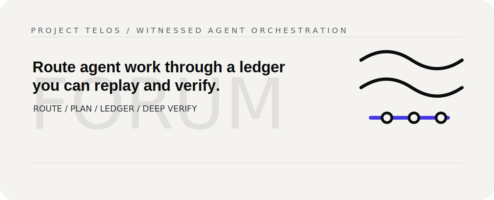

<p align="center">
  
</p>
<!-- Project mark: docs/brand/forum-mark.svg -->

# Forum

> Route agent work through a ledger you can replay and verify.

[Project Telos](https://harperz9.github.io) | [gather](https://github.com/HarperZ9/gather) | [crucible](https://github.com/HarperZ9/crucible) | [index](https://github.com/HarperZ9/index) | [forum](https://github.com/HarperZ9/forum) | [telos](https://github.com/HarperZ9/telos)

[](https://github.com/HarperZ9/forum/actions/workflows/ci.yml)


## Try it

```bash
pip install forum-engine
```

```bash
git clone https://github.com/HarperZ9/forum
cd forum
python examples/demo.py
```

Open the visual ledger replay surface at [`examples/forum-demo.html`](examples/forum-demo.html).

## Why it matters

Agent fleets fail quietly when their route is just output. Forum makes the route the
artifact: every plan, task, result, and verification step lands in a replayable ledger.
It gives the people depending on the run something better than confidence: a record
they can inspect, replay, and challenge.

## Work with it

Forum is the right first test when the hard part is not one model answer, but the route
a team of agents took to get there. Bring it a clinical intake, newsroom check, studio
pipeline, due-diligence pass, or token-budget problem where the path matters as much as
the answer. The most useful next pressure is real use: workflows that need replay,
verifier feedback, and research support for executor and witness hardening.

## What it does

Every few months there's a new framework for orchestrating AI agents. You wire one
up, hand it a task, and it works. Then you try to run it for real, and you hit the
question that actually matters: what happened on that run, and can you prove it?
Usually all you've got is a pile of model output and a log you're supposed to trust.

Forum starts from that question. It's an orchestration engine for fleets of agents,
and the idea underneath it is simple. The record of what happened isn't a side effect
of the work. It is the work. Every routing decision, every task, every result goes
into a ledger you can verify, replay, and trace.

Here's why it's built this way. A language model has no memory of its own. Each call
starts from nothing. If you want to build something dependable on top of that, you
have to give a forgetful mind two things it can't supply for itself: a record that
outlives the conversation, and a way to check that record instead of trusting it. You
also need reach, the ability to act across a lot of agents at once. That's the real
project. The small zero-dependency pieces in this repo aren't the goal. They're the
bricks.

Everything here is built, tested, and on PyPI. The foundation (ledger, router, planner),
the runtime that executes a plan across agents and witnesses every step, model-agnostic
executors (any command, any OpenAI-compatible server, the Anthropic API), the control
loop that turns a plain request into one verified answer, a durable ledger that survives
a restart and lets a run resume from where it stopped, an always-on daemon over HTTP and
MCP, and a `forum` command. On top of that sit the parts that make a run trustworthy and
lean: a bounded budget, witnessed model-tier escalation, a verified intent check, a
delivery floor that tightens verbose answers without dropping a request's terms, typed
data-flow between tasks, and clean seams for a peer brain to supply context and an
external verifier to check the answer.

## Watch it work

```bash
git clone https://github.com/HarperZ9/forum
cd forum
python examples/demo.py        # no install, nothing to download
```

The demo routes a few requests, plans a small dependency graph, records every step,
and then does the interesting part. It quietly corrupts a stored result and checks
whether the ledger notices.

```
1. Routing (deterministic Tier-0; decides a lane or escalates)
   'build the database schema and the auth endpoint'  ->  backend
    'build the react component and css for the page'  ->  frontend
               'write the readme docs and the guide'  ->  docs
                                  'summon a unicorn'  ->  escalate -> needs an LLM classifier (confidence 0.00)

2. Planning (DAG -> parallel waves, capped by policy max_parallel=2)
  wave 0: ['T1']
  wave 1: ['T2']
  wave 2: ['T3', 'T4']

4. Accountability: verify, tamper-detect, replay
  verify() (chain)      : True
  verify(deep=True)     : True
  causal chain of last  : request -> plan -> task -> result

   ...now tamper with a stored payload body (seq 2)
  verify() (chain only) : True   <- chain hashes still link
  verify(deep=True)     : False  <- body tamper caught
```

Look at those last two lines. The chain of hashes still links, so a quick check
passes. But the contents of one record no longer match what was promised, and the
deeper check says so. You don't have to trust the record. You can check it.

To see the engine run a whole plan instead of just the ledger, there's a second
example:

```bash
python examples/run.py
```

It routes a request, runs a three-step plan across agents (with a stub standing in for
a real model), and verifies the entire run from the ledger at the end.

## The pains it answers

These are real complaints from people running agent fleets. The project harvests them
and lets each one drive a feature; each maps to something Forum does.

- **"An unattended loop turned a dollar into a hundred overnight."** A `RunBudget` caps a run by model calls and wall-clock; when it is spent the run stops gracefully and witnesses where. `forum submit --max-model-calls N --max-seconds S`. (v1.1)
- **"It drifted wrong and spiraled for hours before anyone caught it."** Every step is witnessed, and after synthesis Forum checks how much of the request the answer still covers, escalating to a model judge when that floor flags. Drift lands on the record, not at hour three. (v1.4, v1.5)
- **"No idea which model actually ran each task."** Every result records the model that produced it, and a failed task escalates up a ladder of stronger models on the auditable verdict, witnessed. (v1.2)
- **"I want to orchestrate my own subscriptions and local models, not a new SaaS."** Zero-dependency, self-hosted, model-agnostic: any command (a local CLI needs no account), any OpenAI-compatible server, or the Anthropic API. The daemon runs on your box. (shipped)
- **"The loop has no contract, no standing authority."** A run carries a witnessed contract, organized context in and a bounded budget, and the ledger is the standing record of what was agreed and what happened. (v1.1)
- **"Long loops exhaust the context window with no recovery."** A run checkpoints at wave boundaries and resumes from the witnessed ledger, reusing what already succeeded; injected context is bounded and pulled fresh per task. (v1.9, v1.10, v1.12)
- **"Model output is a wall of words."** A deterministic delivery floor flags verbose answers; an opt-in reviser tightens them, accepted only if the shorter version still covers the request. (v1.11)
- **"Memory is a routing problem, and stale facts poison it."** Forum plans and runs on organized context pulled from a brain through a clean seam; building and pruning that knowledge graph is a peer's job (the index flagship), and Forum consumes it, witnessed. (v1.1, v1.12)

## More to run

Each example is a short, offline, dependency-free demonstration of one capability:

```bash
python examples/run_request.py       # a plain request: plan, witnessed run, one verified answer
python examples/run_escalation.py    # a failed task escalates up a ladder of stronger models
python examples/run_intent_judge.py  # the intent ladder: a lexical drift floor, then a model judge
python examples/run_delivery.py      # a verbose answer is tightened, accepted only if it stays covered
python examples/run_resume.py        # a crashed run resumes from the ledger, reusing what succeeded
python examples/run_efficiency.py    # bounded prompts and a weighed record
python examples/run_summary.py       # read a run from the ledger, and A/B two runs with forum bench
```

## From the command line

Install it with `pip install forum-engine` (pure standard library, no dependencies come with it), and Forum gives you a `forum` command:

```bash
forum route "build the auth endpoint and the database schema"        # which lane, no model needed
forum submit "ship a login API" --cmd "ollama run llama3"            # plan, run, answer with a local model, no account
forum serve --chat-url http://localhost:11434/v1/chat/completions --model llama3   # the HTTP daemon
forum mcp --cmd "ollama run llama3"                                  # the MCP stdio server
forum ledger verify                                                  # check the record
forum ledger show --limit 20                                         # the last 20 entries
```

`submit`, `serve`, and `mcp` reach a model, and Forum is model-agnostic about which.
`--cmd "<any command>"` runs any model (a local CLI needs no account), `--chat-url`
talks to any OpenAI-compatible server (local or cloud), and `--api` is one specific
provider (Anthropic). Routing and the ledger commands need no model at all. See
[RUNNING.md](RUNNING.md).

## How the ledger works

A log tells you what a program says it did. A ledger lets you prove it. Two old ideas
do most of the work.

The first is a hash chain. Every entry carries a fingerprint of the one before it.
Edit a past entry, drop one, or shuffle the order, and the fingerprints stop lining
up. `verify()` walks the chain and tells you where.

The second is content addressing. The bulky parts, the prompts and the outputs, are
stored under a fingerprint of their own bytes rather than inline. That keeps the chain
small, and it has a useful side effect: you can redact a sensitive body down to its
fingerprint and the chain still checks out. When the bodies are there,
`verify(deep=True)` re-hashes each one to make sure it still matches. That's what
catches the swapped result in the demo.

Everything else falls out of those two. `replay(until=...)` rebuilds the exact state
at any past point, which works because the core is pure and entries never change.
`causal_chain(seq)` follows the parent links to answer the question every postmortem
comes back to: why did this happen? And `checkpoint()` folds the whole history into
one Merkle root. The leaves and the internal nodes are tagged differently, and odd
nodes get carried up rather than duplicated, so it avoids the second-preimage
collision (CVE-2012-2459) that naive Merkle code runs into.

None of this is worth much if the record dies with the process. By default the
ledger lives in memory, which is right for a test or a single run. Point it at a
`FileStorage` instead and every entry is appended to a file and fsynced before the
next one, so the ledger survives a restart and still verifies, replays, and
checkpoints exactly. If a crash cuts the final write short, that half-written line
is dropped on reload and the rest of the record stands. Tampering does not get a
quieter treatment: a reordered file still loads, and `verify()` still says no.

## What's here

- `forum.ledger`: the record. Hash chain, content-addressed bodies, `verify` / `verify(deep=True)`, `replay`, `causal_chain`, Merkle `checkpoint`.
- `forum.storage`: where the record lives. An in-memory store for tests and short runs, and a durable `FileStorage` (append-only JSONL) so a ledger survives a restart and stays verifiable. It fsyncs every append by default; `fsync_each=False` plus `ledger.sync()` batches that for throughput, with the durability window stated plainly.
- `forum.routing`: a router that reads a request, picks a lane, and only falls back to a model when the keywords genuinely can't decide.
- `forum.plan` and `forum.dispatch`: a task graph compiled into parallel waves (cycles and missing dependencies caught up front), with typed edges. A data edge feeds its upstream's witnessed output into the downstream task so it builds on real work; an order edge only sequences. Every edge and every data hand-off is witnessed. A run resumes from the ledger, reusing tasks already witnessed as successful and re-running only the rest, and can checkpoint each wave as a savepoint. Injected upstream output is capped to keep prompts bounded, with the full output kept in the ledger.
- `forum.roster`: the cast of specialists, written as plain data in a TOML file and validated on load. Ships with a built-in default roster of 24 plain capability lanes (`load_default()`), so a fresh install has a real roster out of the box.
- `forum.policy`: the rules of the room. Which work can run, and how much at once.
- `forum.executor` / `forum.chat_executor` / `forum.api_executor`: how work actually runs, model-agnostic. A stub for tests, a `SubprocessExecutor` that runs any command (a local model CLI needs no account), a `ChatExecutor` for any OpenAI-compatible server (local or cloud), and an `ApiExecutor` for the Anthropic API. A failing task is witnessed, not fatal; each result records which model produced it, and a failed task can escalate up a ladder of stronger executors, witnessed.
- `forum.control` and `Orchestrator.submit`: the control loop. A Coordinator turns a plain request into a plan, a Classifier picks an agent when keywords can't, a Validator judges each result, and a Synthesizer writes one answer. Every step is witnessed.
- `forum.context` and `forum.budget`: the run contract. A `ContextProvider` seam so a run plans on organized context from a brain (the index flagship), and routes fresh task-specific context to each agent at dispatch, witnessed as the exact context that shaped each step; and a `RunBudget` that bounds a run and witnesses where it stopped.
- `forum.verify`: the verification seam. A `VerifierProvider` lets an external verifier (a peer flagship, a proof-checker, a test runner) check the answer Forum produced, and the verdict is witnessed. The peer of the context seam: context flows in before the run, verification comes back after it. The default abstains, so Forum stands alone.
- `forum.delivery`: how the answer reads. A deterministic floor (`assess`) measures concision (sentence length, filler) and flags a dense answer, witnessed every run; an opt-in `Reviser` seam tightens a flagged answer, and Forum accepts the tighter version only if it still covers the request. The floor stands alone; the reviser is the model rung, verified before it replaces the answer.
- `forum.daemon` / `forum.http_surface`: an always-on HTTP service (stdlib asyncio, no framework) over one long-lived, durable ledger. Submit a request, read a witnessed answer, and verify or replay the record over HTTP.
- `forum.mcp_surface`: the same tools over MCP (JSON-RPC on stdio), the lone optional edge. It is a thin adapter over the HTTP surface, so the two can never drift.
- `forum.intent` and the intent-judge: did the run answer the request? After synthesis, a deterministic coverage of the request's vocabulary by the answer is witnessed (a lexical floor that flags drift, never blocks). When it flags and you opt in (`IntentJudge`, or `forum submit --judge-intent`), a model resolves whether the answer truly drifted or just paraphrased, witnessed as its own entry and bounded by the budget. Cheap floor first, the model only when the floor earns it.
- `forum.report`: reading the record. `summarize(ledger)` aggregates a witnessed run into counts, model calls, the byte weight of the record, the checkpoint, and the verify result, reading only what was witnessed; `compare(a, b)` (and `forum bench A B`) is the delta between two runs, so you can prove a change helped (or made a run leaner) instead of asserting it.

Pure standard library. No third-party runtime dependencies. The tests run the
primitives directly, tamper detection and the Merkle property included.

## Roadmap

- **Done, the foundation.** Ledger, router, roster, planner, policy. Tested and runnable.
- **Done, the runtime.** An asyncio dispatcher that runs a plan's waves with bounded concurrency, a mailbox actor and a restart supervisor, and an Orchestrator that ties routing, planning, and witnessed dispatch into one call. The engine runs end to end against a stub executor today.
- **Done, real executors.** A `SubprocessExecutor` that runs any command (so any CLI, including a model CLI), and an `ApiExecutor` that drives a model over the Anthropic API, both behind the one executor seam. A failing task is witnessed, not fatal.
- **Done, the control loop.** A Coordinator that turns a plain request into a plan, a Classifier, a Validator that judges each result (a failed task is witnessed, not blessed), and a Synthesizer that writes one answer. `Orchestrator.submit` runs the whole loop, witnessed.
- **Done, durable storage.** A file-backed `FileStorage` (append-only JSONL) so a ledger outlives the process: it recovers exactly on restart, tolerates a crash-torn final write, and stays tamper-evident.
- **Done, the default roster.** 24 domain-neutral capability lanes (engineering, graphics, support, research) shipped in the box and loaded with `roster.load_default()`. Plain capability names, every lane keyword-routable.
- **Done, the daemon (HTTP).** A stdlib-asyncio HTTP service over one durable ledger: route, plan, submit, and verify or replay the record over HTTP. Every request witnessed into the same record.
- **Done, the MCP surface.** The same tools over MCP (JSON-RPC on stdio), a thin adapter over the HTTP surface so the two cannot drift. The lone optional edge.
- **Done, the CLI.** A `forum` command: route, submit, serve, mcp, and ledger verify / show / replay / get. Pick a model with `--api` or `--cmd`.
- **Done, hardened and proven.** Each verdict chains to the result it judged, the routing ladder reaches the Classifier on escalation (`assign` / `submit_one`), and a gated test proves the whole loop against a real model. See [RUNNING.md](RUNNING.md).
- **1.0.** Durable, verifiable, daemonized, installable, documented. The functional engine is complete.
- **1.1, the run contract.** A ContextProvider seam (plan on a brain's organized context, witnessed) and a RunBudget that bounds a run. Research-informed.
- **1.2, witnessed escalation.** Model identity in the ledger and validator-driven escalation up a ladder of stronger executors, on a verifiable signal not model confidence. Research-informed.
- **1.3, reading the record.** A run summary aggregated purely from the witnessed ledger (`forum ledger summary`), and a ledger A/B (`forum bench`) so an improvement is measured from the record, not claimed.
- **1.4, did the run answer?** A witnessed intent check: how much of the request the final answer covers, recorded and surfaced in the summary and A/B. A reproducible lexical floor; a grounded model intent-judge is the next rung.
- **1.5, the intent-judge.** The rung above the floor: when the lexical check flags drift, an opt-in model judge resolves whether the answer truly drifted or just paraphrased, witnessed and budget-bounded. Cheap-first, like routing and escalation.
- **1.6, the DAG flows data.** Typed edges: a data edge feeds its upstream's witnessed output into the downstream task, an order edge only sequences. Existing plans now flow data downstream instead of dropping it, and every edge and hand-off is witnessed.
- **1.7, the verification seam.** A VerifierProvider seam, the peer of the context seam, so an external verifier checks the answer after the run, witnessed. The default abstains; Forum stands alone.
- **1.8, opt-in batched fsync.** A throughput option for the durable ledger: defer the per-append fsync and force it on demand with `ledger.sync()`. The default stays fsync-every-append; the tradeoff is stated plainly.
- **1.9, phased checkpoints and resume.** A run resumes from the witnessed ledger, reusing successful tasks and re-running only the rest; each wave can checkpoint as a savepoint. The ledger is the resume state, no model in the loop.
- **1.10, efficiency.** Bounded upstream injection (cap the prompt, keep the full output in the ledger) and a weighed record (`payload_bytes`) so a leaner run is provable in `forum bench`.
- **1.11, the delivery ladder.** A deterministic concision floor on the answer, and an opt-in verified tightening: a reviser shortens a flagged answer, accepted only if it stays covered. Less word-dense, no request term dropped.
- **1.12, per-task context.** The ContextProvider seam routed to every task: each agent gets fresh, task-specific context at dispatch, capped and witnessed. The Forum-native half of context management, composing with a brain through the seam.
- **Beyond.** A ledger-reading dashboard; deeper context management (a context budget and compact-on-limit, composing with the brain); and the code-readability half of the quality contract (the concision half shipped in 1.11), peers not one absorbing the other.

## Docs

- [ARCHITECTURE.md](ARCHITECTURE.md): the layers, the ledger, and the surfaces.
- [RUNNING.md](RUNNING.md): run it against a real model, over the API or a model CLI.
- [SECURITY.md](SECURITY.md): the trust model, the no-shell guarantee, and sandboxing.
- [RELEASING.md](RELEASING.md): how a release is built and published.

## License

Forum is fair-source: the code is open to read, run, and build on, with commercial
use reserved so the project can fund its own development. Copyright stays with the
author. See [LICENSE](LICENSE) for the exact terms.
